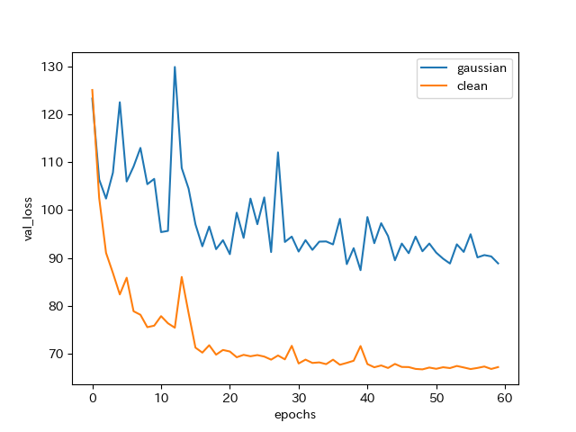
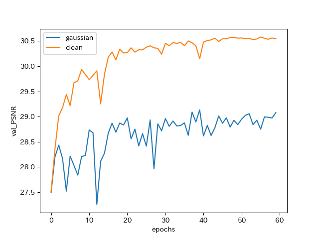
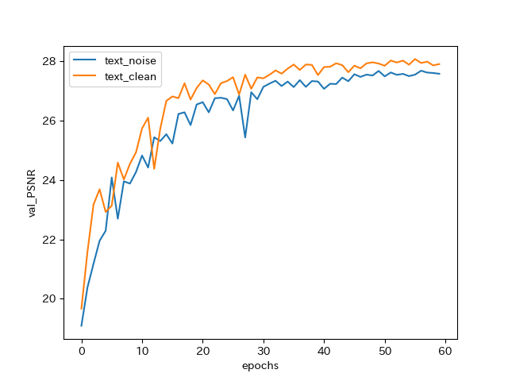
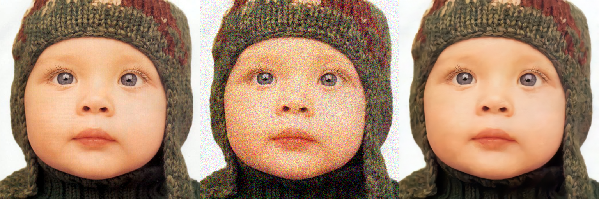
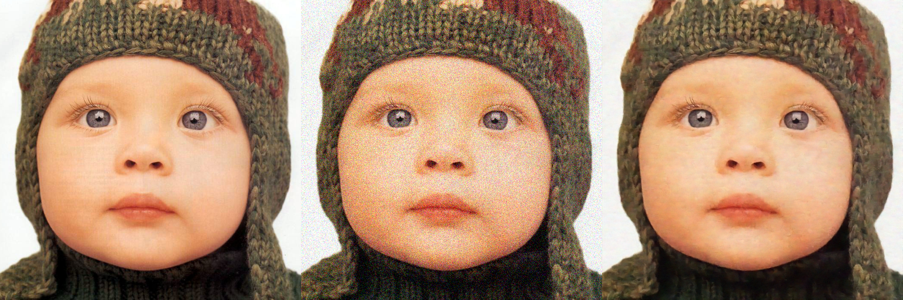
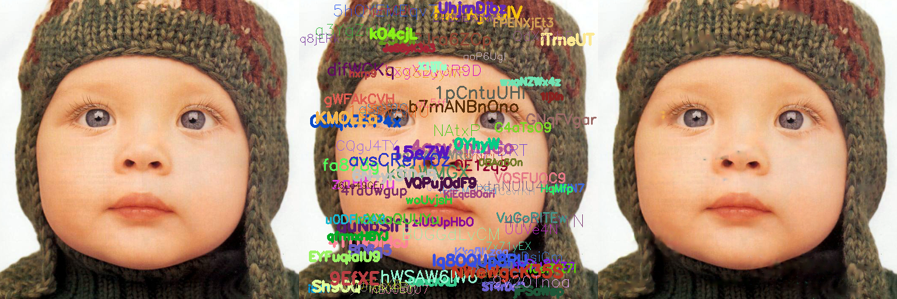
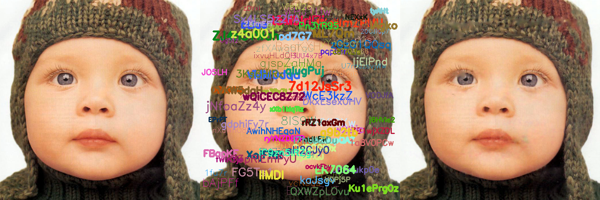
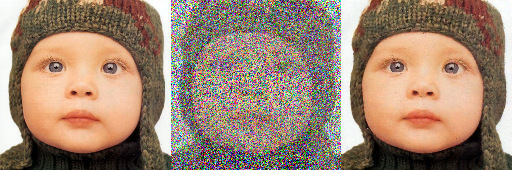
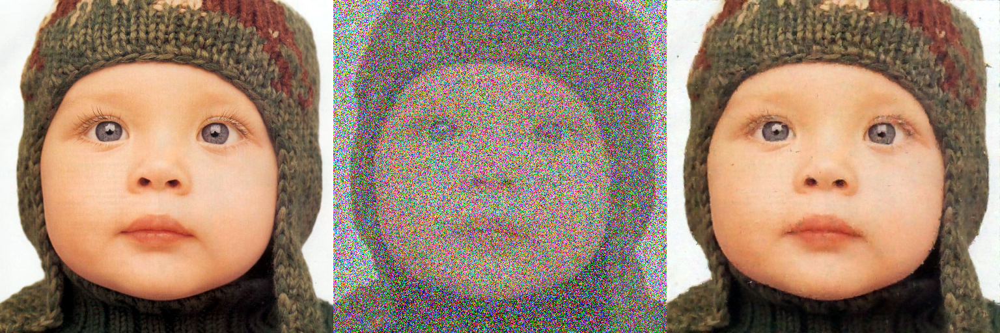

# Noise2Noise

This is an unofficial and partial Keras implementation of "Noise2Noise: Learning Image Restoration without Clean Data" [1].

There are several things different from the original paper
(but not a fatal problem to see how the noise2noise training framework works):
- Training dataset (orignal: ImageNet, this repository: [2])
- Model (original: RED30 [3], this repository: SRResNet [4] or UNet [5])

Updates:
- [Sep. 21, 2018] Random-valued impulse noise model and L0 loss were added
- [Aug. 25, 2018] UNet model can be used in training
- [Aug. 25, 2018] Add trained weights

## Dependencies
- Keras >= 2.1.2, TensorFlow, NumPy, OpenCV

## Train Noise2Noise

### Download Dataset

```bash
mkdir dataset
cd dataset
wget https://cv.snu.ac.kr/research/VDSR/train_data.zip
wget https://cv.snu.ac.kr/research/VDSR/test_data.zip
unzip train_data.zip
unzip test_data.zip
cd ..
```

Any dataset can be used in training and validation instead of the above dataset.

### Train Model
Please see `python3 train.py -h` for optional arguments.


#### Train with Gaussian noise
```bash
# train model using (noise, noise) pairs (noise2noise)
python3 train.py --image_dir dataset/291 --test_dir dataset/Set14 --image_size 128 --batch_size 8 --lr 0.001 --output_path gaussian

# train model using (noise, clean) paris (standard training)
python3 train.py --image_dir dataset/291 --test_dir dataset/Set14 --image_size 128 --batch_size 8 --lr 0.001 --target_noise_model clean --output_path clean
```


#### Train with text insertion

```bash
# train model using (noise, noise) pairs (noise2noise)
python3 train.py --image_dir dataset/291 --test_dir dataset/Set14 --image_size 128 --batch_size 8 --lr 0.001 --source_noise_model text,0,50 --target_noise_model text,0,50 --val_noise_model text,25,25 --loss mae --output_path text_noise

# train model using (noise, clean) paris (standard training)
python3 train.py --image_dir dataset/291 --test_dir dataset/Set14 --image_size 128 --batch_size 8 --lr 0.001 --source_noise_model text,0,50 --target_noise_model clean --val_noise_model text,25,25 --loss mae --output_path text_clean
```

#### Train with random-valued impulse noise

```bash
# train model using (noise, noise) pairs (noise2noise)
python3 train.py --image_dir dataset/291 --test_dir dataset/Set14 --image_size 128 --batch_size 8 --lr 0.001 --source_noise_model impulse,0,95 --target_noise_model impulse,0,95 --val_noise_model impulse,70,70 --loss l0 --output_path impulse_noise

# train model using (noise, clean) paris (standard training)
python3 train.py --image_dir dataset/291 --test_dir dataset/Set14 --image_size 128 --batch_size 8 --lr 0.001 --source_noise_model impulse,0,95 --target_noise_model clean --val_noise_model impulse,70,70 --loss l0 --output_path impulse_clean
```

##### Model architectures
With `--model unet`, UNet model can be trained instead of SRResNet.

##### Resume training
With `--weight path/to/weight/file`, training can be resumed with trained weights.


### Noise Models
Using `source_noise_model`, `target_noise_model`, and `val_noise_model` arguments,
arbitrary noise models can be set for source images, target images, and validatoin images respectively.
Default values are taken from the experiment in [1].

- Gaussian noise
  - gaussian,min_stddev,max_stddev (e.g. gaussian,0,50)
- Clean target
  - clean
- Text insertion
  - text,min_occupancy,max_occupancy (e.g. text,0,50)
- Random-valued impulse noise
  - impulse,min_occupancy,max_occupancy (e.g. impulse,0,50)

You can see how these noise models work by:

```bash
python3 noise_model.py --noise_model text,0,95
```

### Results
#### Plot training history

```bash
python3 plot_history.py --input1 gaussian --input2 clean
```

##### Gaussian noise





From the above result, I confirm that we can train denoising model using noisy targets
but it is not comparable to the model trained using clean targets.
If UNet is used, the result becomes 29.67 (noisy targets) vs. 30.14 (clean targets).

##### Text insertion




#### Random-valued impulse noise


#### Check denoising result

```bash
python3 test_model.py --weight_file [trained_model_path] --image_dir dataset/Set14
```

The detailed options are:

```bash
optional arguments:
  -h, --help            show this help message and exit
  --image_dir IMAGE_DIR
                        test image dir (default: None)
  --model MODEL         model architecture ('srresnet' or 'unet') (default:
                        srresnet)
  --weight_file WEIGHT_FILE
                        trained weight file (default: None)
  --test_noise_model TEST_NOISE_MODEL
                        noise model for test images (default: gaussian,25,25)
  --output_dir OUTPUT_DIR
                        if set, save resulting images otherwise show result
                        using imshow (default: None)
```
This script adds noise using `test_noise_model` to each image in `image_dir` and performs denoising.
If you want to perform denoising to already noisy images, use `--test_noise_model clean`.

##### Gaussian noise
Denoising result by clean target model (left to right: original, degraded image, denoised image):



Denoising result by noise target model:



##### Text insertion
Denoising result by clean target model



Denoising result by noise target model:



##### Random-valued impulse noise
Denoising result by clean target model



Denoising result by noise target model:




#### Trained weights

[Gaussian noise, noise target](https://github.com/yu4u/noise2noise/releases/download/v0.1/weights.040-87.447-29.13496_gauss_noise.hdf5)

[Gaussian noise, clean target](https://github.com/yu4u/noise2noise/releases/download/v0.1/weights.056-66.803-30.57923_gauss_clean.hdf5)

[Text insertion, noise target](https://github.com/yu4u/noise2noise/releases/download/v0.1/weights.057-4.796-27.68533_text_noise.hdf5)

[Text insertion, clean target](https://github.com/yu4u/noise2noise/releases/download/v0.1/weights.056-4.172-28.07752_text_clean.hdf5)

[Random-valued impulse noise, noise target](https://github.com/yu4u/noise2noise/releases/download/v0.1/weights.047-2.317-24.30238_impulse_noise.hdf5)

[Random-valued impulse noise, clean target](https://github.com/yu4u/noise2noise/releases/download/v0.1/weights.038-4.547-24.81654_impulse_clean.hdf5)

### TODOs

- [x] Compare (noise, clean) training and (noise, noise) training
- [x] Add different noise models
- [x] Write readme

## References

[1] J. Lehtinen, J. Munkberg, J. Hasselgren, S. Laine, T. Karras, M. Aittala, 
T. Aila, "Noise2Noise: Learning Image Restoration without Clean Data," in Proc. of ICML, 2018.

[2] J. Kim, J. K. Lee, and K. M. Lee, "Accurate Image Super-Resolution Using Very Deep Convolutional Networks," in Proc. of CVPR, 2016.

[3] X.-J. Mao, C. Shen, and Y.-B. Yang, "Image
Restoration Using Convolutional Auto-Encoders with
Symmetric Skip Connections," in Proc. of NIPS, 2016.

[4] C. Ledig, et al., "Photo-Realistic Single Image Super-Resolution Using a Generative Adversarial Network," in Proc. of CVPR, 2017.

[5] O. Ronneberger, P. Fischer, and T. Brox, "U-Net: Convolutional Networks for Biomedical Image Segmentation," in MICCAI, 2015.
